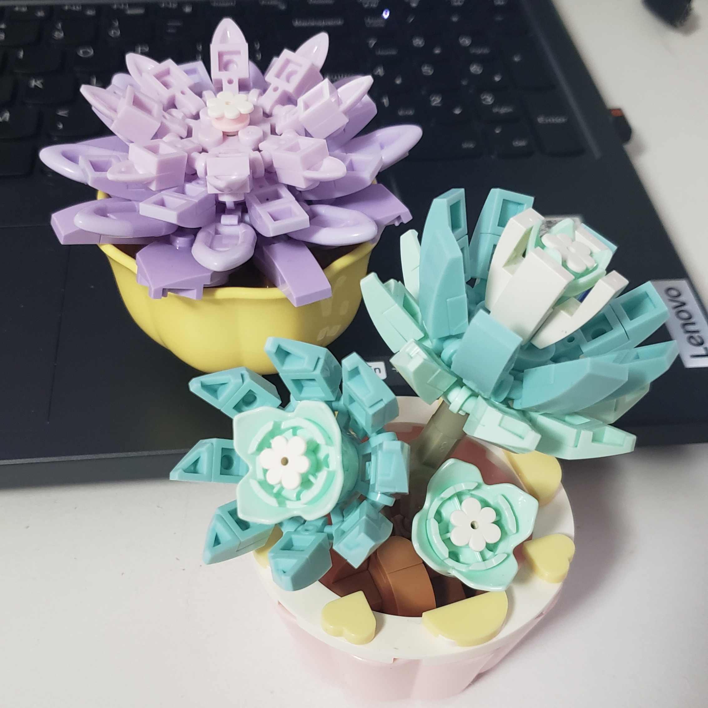
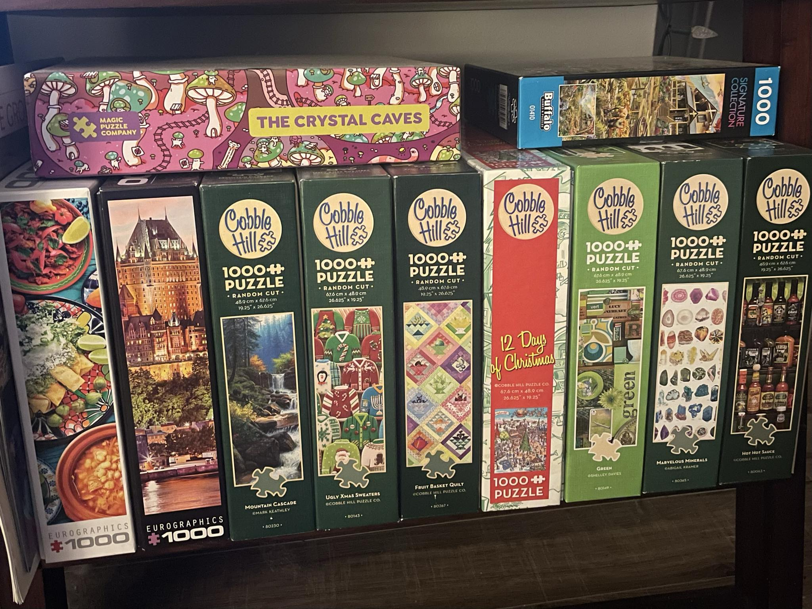

# Team Name Meghan Damen and Kristina Bendzsel
 Hello! We are very excited to be in the IDP3 program & can't wait to learn more about web design and decelopment. Here is a little bit about us...

 ## Meghan Damen
 My Hobbies
- Art: painting, drawinging, digital art, small animations
- Video Games: valorant, minecraft, lethal company, GTA V
- Ice skating and roller skating

I like to travel, my favourite country I've visited is Peru. There i did a 4 day hike through the jungle to see Machu Picchu. During the hike I saw the clearest night sky I've ever seen and I can still recall all the stars in the night. It was a super cool experience.

Here are my favourite things in my room and my biggest inspiration for everything right now.

I won them in a claw machine arcade :)

## Kristina Bendzsel
My Hobbies
- Reading: The most recent books I've read are Gone Girl by Gillian Flynn and Between the World and Me by Ta-Nehisi Coates
- Puzzles: The best way to wind down after a long day is to throw on a podcast and work on a colourful puzzle for an hour!
- Music: System of a Down, Bad Omens, Gojira, Rainbow Kitten Suprise

I do a lot of cooking in my spare time and my favourite recipe to make is my grandma's chicken soup. She doesn't speak english so I find the best way to connect with her to cook different foods with her. Some of my best childhood memories include making tortillas with her & my cousins!

Here is a photo of some puzzles I've completed over the past two years - this isn't even half of my collection!

## Installation
No Installation required

## Usage
No usage

## Contributing
1. Fork it!
2. Create your feature branch
3. Commit your changes
4. Push to branch
5. Submit a pull request

